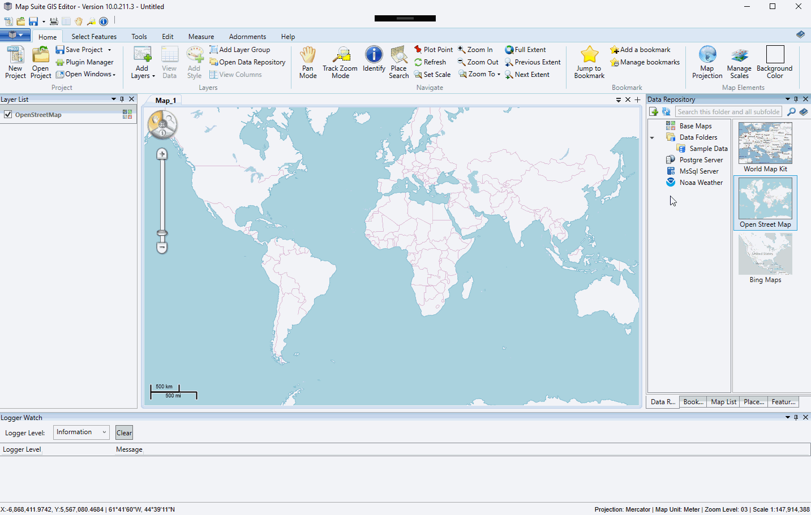

# Map Suite GIS Editor

### Description
Map Suite GIS Editor for Windows lets you design stunning maps, perform geo-analysis and visualize your data. Powerful enough for professional GIS technicians yet accessible enough for nearly anyone who needs to create a map. The GIS Editor is designed as a single-application solution to all of your GIS visualization needs. Now it is open source and free. You can use the Map Suite GIS Editor to: - Quickly build maps using simple and intuitive tools - Visualize data, statistics and trends geographically - Design, style and label rich and detailed maps - Integrate data from a variety of sources, including Web Map Services - Draw right on the map, edit and create feature data - Make your maps publication-ready with titles, legends and annotations You can do all of this without wading through stacks of cryptic toolbars or scouring nested menus. The GIS Editor's simple ribbon bar interface puts its full complement of GIS tools at your fingertips in an easy-to-understand way. Wizards make short work of batch geoprocessing, geocoding and re-projection operations. And with the built-in Data Repository, you can keep all of your data close at hand, regardless of where it lives.

Looking for a customized GIS Editor or custom plug-ins? Please contact sales@thinkgeo.com for more details. 

Please refer to [Wiki](http://wiki.thinkgeo.com/wiki/map_suite_desktop_for_wpf) for the details.

### Requirements
This sample makes use of the following NuGet Packages

[MapSuite 10.0.0](https://www.nuget.org/packages?q=ThinkGeo)

### FAQ
- __Q: I downloaded the released exe, but it won't run on my machine.__  
A: Here are some things to check.
  - Check whether your environment meets the system requirements listed under: http://wiki.thinkgeo.com/wiki/map_suite_desktop_for_wpf_installation_guide
  - Check to see if the assemblies were blocked during download. Especially the plugins which are placed under _Plugins/ThinkGeo/GisEditorPluginCore.dll_. Right click on the dll and open the property dialog. If there is an `Unblock` checkbox in the _Security_ section on the bottom, check it to make sure the major plugins are unblocked. Then try again.
  - Check whether the System32/SysWow64 root folder exists Microsoft Visual CRunTime 100/110/120. If those files not existing, please use "MapSuiteRuntimeDependencies.msi" tool to install them: https://wiki.thinkgeo.com/wiki/map_suite_runtime_license_guide_for_desktop#deploying_applications
  
- __Q: I cloned this project, but it throws an exception when I try to debug it.__  
A: This project is protected by ThinkGeo's licensing policy. It includes one runtime license of Map Suite Desktop which allows you to run the app without limitation. However, if you want to debug this project, a development license is required.

